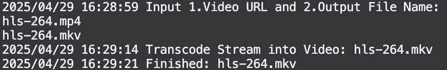

# media_transcoder

## Main Features
* Download and trancode into specific format
    * mp4
    * mkv
    * avi
    * etc...
<!-- * Experimental Video Encoding
    * AV1
    * VP7
    * VP9 -->
* Default Video Codec
    * libx264 (H.264)
## Requirements
* ffmpeg

## Example
* Url Save to Video


* Transcode Video to Video



* Concat files
```
ffmpeg -f concat -i file.txt -c copy <filename.mp4>
```